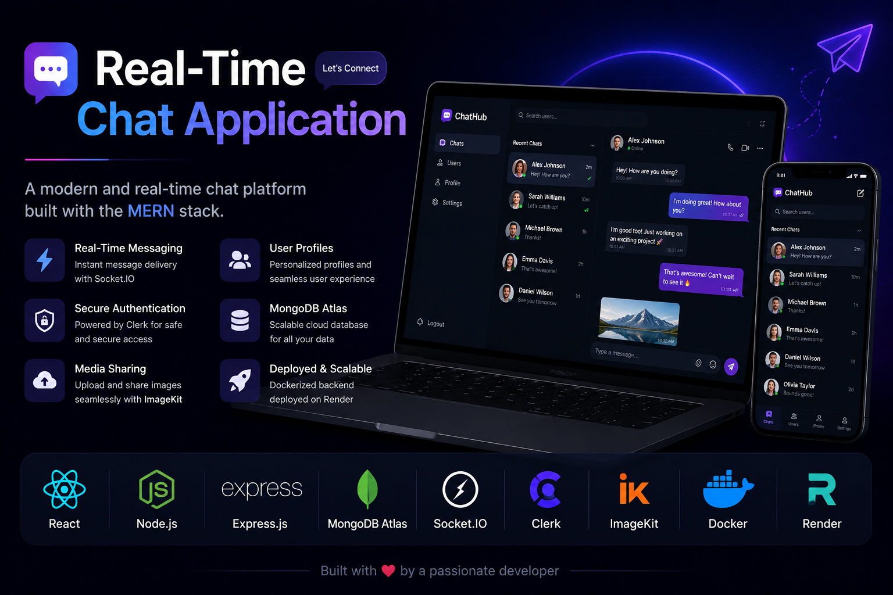
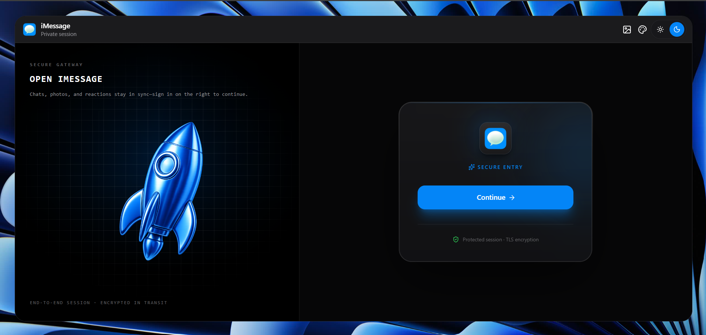
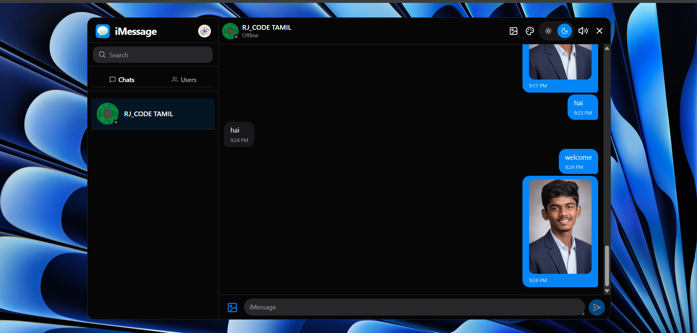
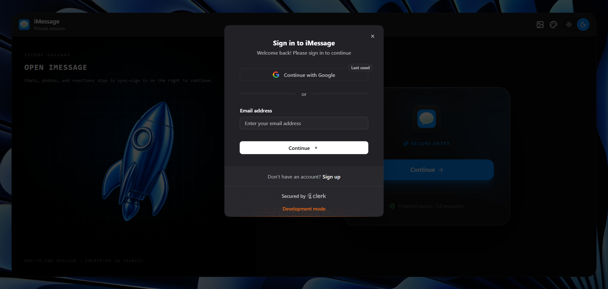
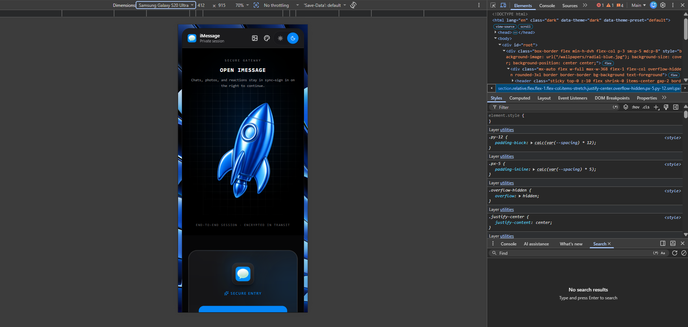

<div align="center">

# 💬 Real-Time Chat Application

### 🚀 A Modern Full Stack MERN Chat Application with Real-Time Messaging

> **A production-ready real-time chat application built using the MERN Stack with Clerk Authentication, Socket.IO, MongoDB Atlas, Docker, ImageKit, and Render.**

<br>

<!-- Replace this with your banner image -->


<br><br>


</div>

---

# 📖 About The Project

This project is a **Modern Full Stack Real-Time Chat Application** developed using the **MERN Stack**. It enables users to securely authenticate, communicate in real time, upload media, and experience a modern responsive chat interface.

The application follows modern backend architecture by integrating **Clerk Authentication**, **MongoDB Atlas**, **Socket.IO**, **Docker**, **ImageKit**, and **Render Deployment**.

Rather than focusing only on building features, this project helped me understand how real-world applications are structured, debugged, and deployed.

---

# 🌐 Live Demo

> 🔗 **Live Website**

https://realtime-chat-app-4a7m.onrender.com

---

# 💻 GitHub Repository

https://github.com/Rohithvasanthan/Realtime_Chat_App

---

# ✨ Features

### 🔐 Authentication
- Secure User Authentication using Clerk
- Protected Routes
- User Session Management
- Automatic User Synchronization

---

### 💬 Chat Features

- Real-Time Messaging
- Responsive Chat Interface
- Fast Message Delivery
- Modern UI Design

---

### 👤 User Features

- User Profiles
- Profile Images
- User Information Synchronization
- Automatic Database Updates

---

### 🖼️ Media Upload

- Upload Images
- Cloud Image Storage using ImageKit
- Optimized Media URLs
- Fast Image Delivery

---

### ☁️ Backend Features

- REST APIs
- MongoDB Atlas Database
- Dockerized Deployment
- Production Ready Server
- Clerk Webhooks
- Environment Variables
- Cloud Deployment

---

# 🛠 Tech Stack

## Frontend

- React.js
- JavaScript (ES6+)
- CSS
- Axios

---

## Backend

- Node.js
- Express.js

---

## Database

- MongoDB Atlas
- Mongoose

---

## Authentication

- Clerk Authentication
- Clerk Webhooks

---

## Media Storage

- ImageKit

---

## Real-Time Communication

- Socket.IO

---

## Deployment

- Docker
- Render

---

## Development Tools

- VS Code
- Git
- GitHub
- Postman
- Thunder Client

---

# 📸 Project Screenshots

## 🏠 Home Page

> 

---

## 💬 Chat Screen

> 

---

## 🔐 Authentication

> 

---

# 🎯 Project Objectives

This project was built to understand:

- Full Stack MERN Development
- Backend Architecture
- Authentication
- Database Design
- Real-Time Communication
- Production Deployment
- Docker
- Debugging Real World Applications

---

# ⭐ Key Highlights

✅ Full Stack MERN Project

✅ Secure Authentication

✅ MongoDB Atlas Integration

✅ Docker Deployment

✅ Render Deployment

✅ Image Upload Support

✅ Clerk Webhooks

✅ Real-Time Communication

✅ Production Ready Architecture

---

# 📚 What I Learned

While building this project, I learned:

- Express.js Backend Development
- MongoDB & Mongoose
- REST APIs
- Authentication Flow
- Clerk Webhooks
- Image Upload APIs
- Docker Basics
- Render Deployment
- Debugging Production Applications
- Git & GitHub Workflow

---

# 📂 Project Structure

```bash
RealTimeChatApp
│
├── backend
│   ├── src
│   │   ├── controllers
│   │   ├── lib
│   │   ├── models
│   │   ├── routes
│   │   ├── webhooks
│   │   └── index.js
│   │
│   ├── package.json
│   └── .env
│
├── frontend
│   ├── src
│   ├── public
│   ├── package.json
│   └── vite.config.js
│
├── assets
│   ├── banner.png
│   ├── login.png
│   ├── home.png
│   ├── chat.png
│   └── architecture.png
│
├── Dockerfile
├── .dockerignore
├── README.md
└── .gitignore
```

---

# ⚙️ Installation

Clone the repository

```bash
git clone https://github.com/YOUR_USERNAME/YOUR_REPOSITORY.git
```

Move into the project

```bash
cd YOUR_REPOSITORY
```

---

## Backend Setup

```bash
cd backend
npm install
```

Run Backend

```bash
npm run dev
```

---

## Frontend Setup

```bash
cd frontend
npm install
```

Run Frontend

```bash
npm run dev
```

---

# 🔑 Environment Variables

## Backend (.env)

```env
PORT=

MONGO_URI=

FRONTEND_URL=

CLERK_SECRET_KEY=

CLERK_WEBHOOK_SIGNING_SECRET=

IMAGEKIT_PUBLIC_KEY=

IMAGEKIT_PRIVATE_KEY=

IMAGEKIT_URL_ENDPOINT=
```

---

## Frontend (.env)

```env
VITE_API_URL=

VITE_CLERK_PUBLISHABLE_KEY=
```

---

# 🏗 System Architecture

```
                 User
                  │
                  ▼
        React Frontend (Vite)
                  │
        HTTP / Socket.IO
                  │
                  ▼
          Express Backend
          │            │
          │            │
          ▼            ▼
     MongoDB Atlas   Clerk
          │            │
          │            ▼
          │      Authentication
          │
          ▼
      ImageKit
   (Media Storage)
```

---

# 🔄 Authentication Flow

```text
User Opens App
        │
        ▼
Clerk Login
        │
        ▼
Authentication Success
        │
        ▼
Webhook Triggered
        │
        ▼
Backend Receives Event
        │
        ▼
MongoDB User Created
        │
        ▼
User Ready To Chat
```

---

# 💾 Database

## Users Collection

```js
{
   clerkId,
   email,
   fullName,
   profilePic,
   createdAt,
   updatedAt
}
```

---

## Messages Collection

```js
{
   senderId,
   receiverId,
   text,
   image,
   createdAt
}
```

---

# 🐳 Docker Deployment

This project is containerized using Docker.

### Build Docker Image

```bash
docker build -t realtime-chat .
```

### Run Container

```bash
docker run -p 3001:3001 realtime-chat
```

---

# ☁️ Deployment

Application deployed using

- Docker
- Render
- MongoDB Atlas
- Clerk
- ImageKit

Deployment Pipeline

```
GitHub
   │
   ▼
Render
   │
Docker Build
   │
Express Server
   │
MongoDB Atlas
```

---

# 📸 Application Screenshots

## 🔐 Login Page


---

## 🏠 Home Page


---

## 💬 Chat Screen


---

## 📱 Responsive View



---

# 🐛 Challenges Faced

During the development of this project, I encountered several real-world challenges that helped me improve my debugging and problem-solving skills.

### Challenges Solved

- ✅ Dockerfile not detected by Render (`DockerFile` vs `Dockerfile`)
- ✅ Linux and Windows command compatibility (`rm -rf` issue)
- ✅ Docker multi-stage build configuration
- ✅ Clerk Webhook verification failures
- ✅ MongoDB Atlas connection issues
- ✅ User synchronization between Clerk and MongoDB
- ✅ ImageKit media upload configuration
- ✅ Environment variable configuration in production
- ✅ Render deployment debugging
- ✅ Production vs Development environment differences

---

# 🧠 Debugging Journey

This project was more than just building features—it was about learning how to debug real-world production issues.

Some examples include:

- Debugging Docker build failures
- Fixing webhook signature verification
- Understanding Linux vs Windows command differences
- Configuring Render deployments
- Managing environment variables securely
- Fixing MongoDB schema mismatches
- Deploying a full-stack MERN application using Docker

These experiences significantly improved my backend development and deployment skills.

---

# 📚 What I Learned

Throughout this project, I gained practical experience in:

- MERN Stack Development
- Express.js API Development
- MongoDB & Mongoose
- REST API Design
- Clerk Authentication
- Clerk Webhooks
- Image Upload using ImageKit
- Docker Fundamentals
- Docker Multi-Stage Builds
- Render Deployment
- Git & GitHub Workflow
- Environment Variable Management
- Production Debugging
- Real-Time Application Architecture

---

# 🚀 Future Improvements

Planned features include:

- ✅ Typing Indicators
- ✅ Read Receipts
- ✅ Group Chats
- ✅ Voice Messages
- ✅ Video Calling
- ✅ Emoji Reactions
- ✅ Message Search
- ✅ Push Notifications
- ✅ Dark / Light Theme
- ✅ User Blocking
- ✅ Message Encryption
- ✅ File Sharing
- ✅ Admin Dashboard

---

# 📈 Project Status

🚀 Actively Improving

This project is continuously updated with new features, bug fixes, and performance improvements.

---

# 🤝 Contributing

Contributions are always welcome.

1. Fork the repository
2. Create a new branch

```bash
git checkout -b feature-name
```

3. Commit your changes

```bash
git commit -m "Added new feature"
```

4. Push the branch

```bash
git push origin feature-name
```

5. Open a Pull Request

---

# ⭐ If You Like This Project

If you found this project useful,

⭐ Please consider giving this repository a **Star**.

It motivates me to build more open-source projects.

---

# 👨‍💻 Developer

**Rohith Vasanthan E**

🎓 B.E Computer Science Engineering

💻 MERN Stack Developer

🚀 Passionate about Full Stack Development, AI, Cloud, and Open Source.

---

# 📬 Connect With Me

**GitHub**

https://github.com/Rohithvasanthan

**LinkedIn**

https://www.linkedin.com/in/rohithvasanthan18

---

# 📄 License

This project is licensed under the MIT License.

Feel free to use, modify, and learn from this project.

---

# 🙏 Acknowledgements

Special thanks to the amazing technologies and platforms that made this project possible.

- React
- Node.js
- Express.js
- MongoDB Atlas
- Socket.IO
- Clerk
- ImageKit
- Docker
- Render

---

<div align="center">

## ❤️ Thank You for Visiting This Repository!

If you enjoyed exploring this project,

🌟 **Don't forget to Star the repository!**

Made with ❤️ by **Rohith Vasanthan E**

</div>